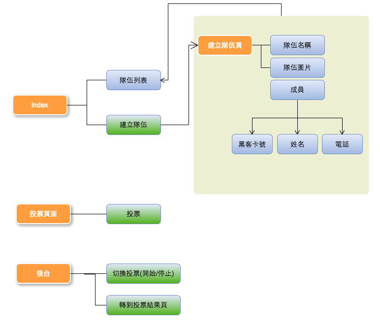

# HangeeHackthon-Vote

For Hackthon 7th final vote. 

## Flow

<!---->

## pre-install

 * node.js@0.10.26
 * npm
 * [mongojs](https://github.com/mafintosh/mongojs)
 * [express@4.11.1rc](http://github.com/strongloop/express/)

## how to start

```
npm start
open http://localhost:8080
```

## api


* Create a team :洗洗睡 (for test)
```
[GET] api/create/test
```
>input date : none


* Create a team
```
[POST] api/team
```
>input data :
```
team {
	name : String,
	imgURL : String,
	projectName : String,
	members : [
			{ name : String, phone : String }, ...	
	],
}
```


* get all teams & team's project info
```
[GET] api/teams
```


* ~~get the teams & team's project info, with id (沒用到~~
```
[GET] api/team:id
```


* ~~modify group & porject info, with id (沒用到~~
```
[PUT] api/teams:id
```


* vote, with id
```
[PUT] /vote:id
```

* vote teamSSS, with id[]

```
[PUT] /voteS
```
>	input date: id Array


* ~~unVote, with id (沒用到~~
```
[PUT] /unVote:id
```


* ~~remove a team (沒用到~~
```
[DELETE] /unVote:id
```


##include

 * [jade](http://jade-lang.com/)
 * [bootstrap](http://getbootstrap.com/)
 * [jquery](http://jquery.com/)
 * [d3](https://github.com/mbostock/d3)
